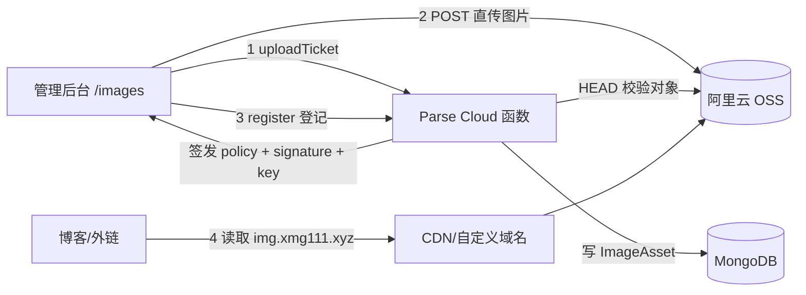

# 图床（OSS 服务端签名直传）设计与部署

## 1. 背景与目标

项目需要独立的图床能力：管理后台传图、生成可预览的外链、按作者管理并删除。之前接入阿里云 OSS 时发现一个问题：浏览器打开 OSS 返回的图片地址会直接下载，无法预览。

本方案解决两件事：

1. 修复“图片地址直接下载”的根因，让图片可内联预览。
2. 按行业最佳实践实现图床：浏览器直传 OSS（不经过业务服务器代理）、不可预测的 key、一次性上传票据、服务端元数据校验。

## 2. 根因：OSS 默认域名对匿名请求强制下载

实测线上对象（bucket `xiaomge-1`）：

| 请求方式 | Content-Type | Content-Disposition | x-oss-force-download |
| --- | --- | --- | --- |
| 匿名 GET（默认域名） | image/png | attachment | true |
| 签名 GET（同对象） | image/png | inline | 无 |
| 签名 HEAD（同对象） | image/png | inline | 无 |

结论：**对象本身的 Content-Type / Content-Disposition 都是正确的**，问题是 OSS 默认域名（`*.oss-cn-*.aliyuncs.com` 与 S3 兼容域名 `*.s3.oss-cn-*.aliyuncs.com`）对匿名请求强制附加 `Content-Disposition: attachment`，浏览器因此直接下载。

修复方式（生产建议二选一）：

- **绑定自定义域名**（推荐）：OSS 控制台把 `img.xmg111.xyz` 绑定到 bucket，DNS 做 CNAME；自定义域名访问不受默认域名强制下载行为影响。
- **关闭默认域名强制下载**：OSS 控制台「基础设置」中关闭默认下载/强制下载开关（如控制台存在该开关）。
- **Parse 代理模式**（开发/小流量兜底）：`OSS_DIRECT_ACCESS=false`，头像与图床外链改为 `/parse/files/{appId}/{key}`，由 Parse Server 从 OSS 拉取后以正确 Content-Type 返回，浏览器可直接预览。

代码层面同时做了兜底：所有图床对象上传时显式写入 `Content-Disposition: inline` 和正确的 `Content-Type`，且 Parse 文件适配器的对外 URL 不再使用 S3 兼容域名。

## 3. 目标架构



上传链路：浏览器先向 Parse 申请一次性票据，拿到签名 policy 后直接 POST 到 OSS；OSS 校验通过后，浏览器再调 `imageHostRegister`，服务端用 HEAD 校验对象元数据并写入 `ImageAsset`。图片文件始终不经过业务服务器，带宽压力最小。

## 4. Cloud 接口

| 函数 | 入参 | 说明 |
| --- | --- | --- |
| `imageHostUploadTicket` | `contentType` | 需登录；每日配额校验；返回 key / policy / signature / uploadUrl / token / maxSize / allowedTypes，5 分钟有效 |
| `imageHostRegister` | `key`, `token` | 需登录；HEAD 校验对象 + **魔数校验**后写入 `ImageAsset`，token 一次性使用 |
| `imageHostList` | `limit`, `skip`（可选） | 需登录；图片列表倒序分页，返回 `total` 与当日 `quota` |
| `imageHostDelete` | `id` | 需登录；仅作者可删，OSS 对象与记录同步删除 |

> 注意：Parse Server 的 Cloud 函数名不能带点号（如 `imageHost.uploadTicket` 会注册失败），图床函数统一使用平铺驼峰命名。

`ImageAsset` 表：`key`、`url`、`mime`、`size`、`author`（指向 `_User`）。读公开，写仅允许服务端 master key，客户端不能伪造记录。

### 4.1 每日配额

- 普通用户每日最多上传 **5 张**（`image-hosting.js` 的 `DAILY_UPLOAD_LIMIT`），按服务器本地自然日统计（以 `ImageAsset` 记录数为准，未登记的票据不算）。
- 在 `imageHostUploadTicket`（未上传前拦截）与 `imageHostRegister`（防并发绕过）双重校验；超限提示「今日上传已达上限（5 张），请明天再试」。
- 列表接口返回 `quota: { used, limit }`，页面顶部展示「今日已上传 x/5 张」。

## 5. 安全设计

- **服务端签名直传**：浏览器只拿短时效 policy，拿不到 AccessKey Secret；policy 将 `key`、`content-type`、`content-disposition`、`cache-control`、大小区间全部钉死。
- **不可预测 key**：`images/yyyy/MM/dd/<uuid>.<ext>`，服务端生成，杜绝路径穿越、覆盖、遍历。
- **类型白名单**：仅 JPG / PNG / WebP / GIF；register 阶段再次 HEAD 校验，防止绕过 policy 直传任意文件。
- **魔数校验**：register 时 Range GET 对象前 12 字节，校验与声明类型一致的 JPEG/PNG/GIF/WebP 签名，杜绝「声明合法 content-type 直传任意内容」的伪图片。
- **一次性票据**：token 绑定用户、key 和有效期，用完即销毁。
- **按作者删除**：只能删除自己上传的图片。
- **访问控制**：bucket 为 public-read（公开图床）；如后续有私密图片，改用私桶 + 签名 URL 或 CDN 鉴权。
- **限流**：图床函数接入 `index.js` 的 rateLimit（上传 30 次/分、删除 60 次/分，按 IP）。

## 6. 前端压缩（方案 A：canvas 重编码）

上传链路不变（浏览器直传 OSS），压缩发生在 `beforeUpload` 阶段（`ecs-frontend/src/lib/imageCompress.js`）：

| 输入 | 处理 |
| --- | --- |
| GIF（动画） | 原样直传，不做 canvas 处理（会变静态图） |
| JPEG | canvas 重编码 JPEG，质量 0.82 |
| PNG / WebP | 优先转 WebP（保留透明通道）；浏览器不支持 WebP 时回退原格式；转 JPEG 时透明区域填白底 |
| 任意类型 | 未超最长边 2048px 且目标格式不变 → 直接用原文件，避免无谓重编码 |

- 压缩异常一律回退原文件，不阻断上传；原始文件超过 30MB 直接拒绝。
- 类型白名单与大小上限由服务端 `imageHostUploadTicket` 下发（`allowedTypes` / `maxSize`），前端不再硬编码（单一事实源）。
- 上传成功、删除、分页等均复用统一 `loadImages`（DRY）；拖拽多文件由上传锁（`uploadingRef`）防并发。

## 6. 部署配置

### 6.1 OSS 控制台

1. 绑定自定义域名：Bucket → 传输管理 → 域名管理，添加 `img.xmg111.xyz`，并按提示把 DNS 从 ECS 指向 bucket 的 CNAME。
2. HTTPS：自定义域名在 OSS 控制台上传证书（可复用 `img.xmg111.xyz` 的 Let's Encrypt 证书）。
3. CORS（浏览器直传必需）：Bucket → 权限管理 → CORS 规则，添加：

```xml
<CORSConfiguration>
  <CORSRule>
    <AllowedOrigin>https://admin.xmg111.xyz</AllowedOrigin>
    <AllowedOrigin>http://localhost:5173</AllowedOrigin>
    <AllowedMethod>GET</AllowedMethod>
    <AllowedMethod>POST</AllowedMethod>
    <AllowedHeader>*</AllowedHeader>
    <ExposeHeader>ETag</ExposeHeader>
  </CORSRule>
</CORSConfiguration>
```

4. 生命周期（可选）：对 `images/` 前缀按需配置过期删除规则，避免历史图片无限累积。

### 6.2 后端 `.env`

```bash
OSS_BUCKET_NAME=xiaomge-1
OSS_REGION=cn-beijing
OSS_ACCESS_KEY_ID=...
OSS_ACCESS_KEY_SECRET=...
# 生产必填：自定义图床域名（未绑定自定义域名前，默认域名仍可能强制下载）
OSS_PUBLIC_URL=https://img.xmg111.xyz
# 图床/头像访问模式：
# true  = 直连 OSS/CDN 地址（需绑定自定义域名，默认域名可能强制下载）
# false = 走 Parse /parse/files 代理取图，浏览器可正常预览（开发/小流量推荐）
OSS_DIRECT_ACCESS=false
# 可选
IMAGE_HOST_MAX_SIZE_MB=10
IMAGE_HOST_KEY_PREFIX=images
```

启动后确认 `GET /health` 正常，`imageHostUploadTicket` 能返回票据。

## 7. 前端

管理后台新增「图床」页（`/images`）：拖拽上传、直传进度条、图片网格预览、复制链接、删除。页面逻辑见 `ecs-frontend/src/pages/ImageHostPage`。

## 8. 与现有头像上传的关系

头像仍走 Parse `Parse.File` → S3 兼容适配器直传 OSS。`OSS_DIRECT_ACCESS=false`（默认关闭直连）时，新头像 URL 走 `/parse/files/{appId}/{name}` 代理，可正常预览；`OSS_PUBLIC_URL` 用于直连模式或绑定自定义域名后的图床外链。**已上传的历史头像**仍指向旧的 S3 兼容域名，需要重新保存头像或做一次 URL 前缀迁移。

## 9. 验收清单

- 匿名 `curl -I <图片 URL>` 返回 `Content-Disposition: inline`，无 `x-oss-force-download`。
- 浏览器直接打开图片地址显示图片，而非触发下载。
- `/images` 上传 JPG/PNG/WebP/GIF 成功；非白名单类型和超限文件被拒绝。
- 复制链接可用；删除后对象与记录同步消失；其他用户不能删除非本人图片。
