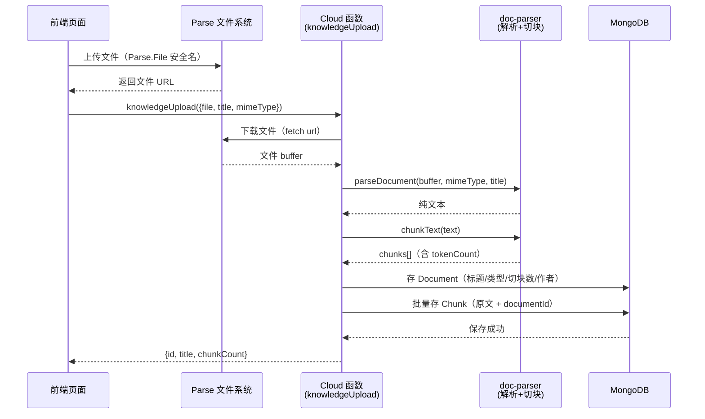
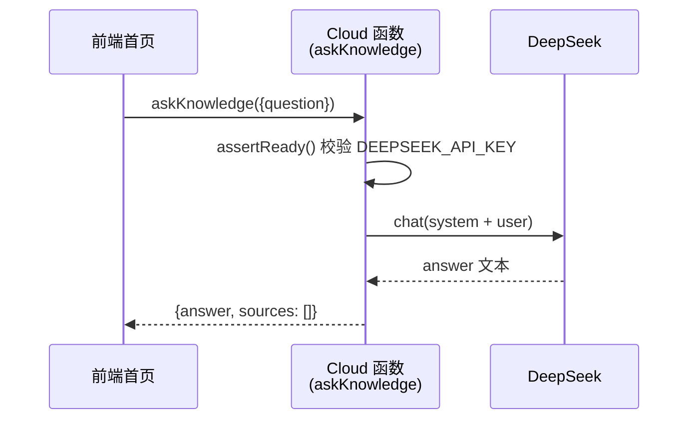
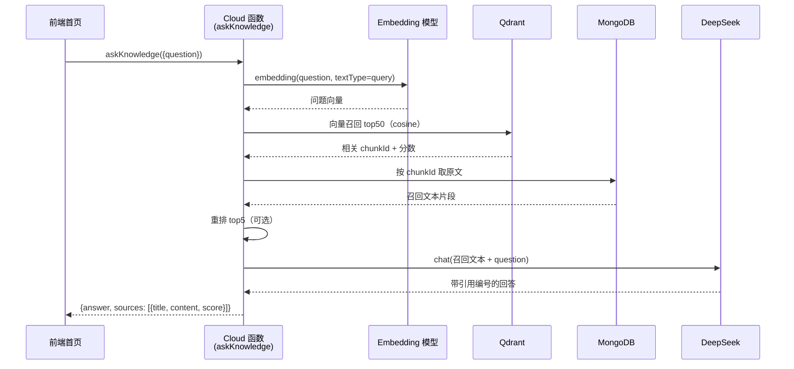

# 知识库（RAG 检索增强生成）技术调研与设计

日期：2026-08-15 ｜ 状态：已落地（embedding + Qdrant 检索链路已接入，重排/关键词召回待迭代）｜ 关联：ecs-test-servers（后端）、ecs-frontend（前端）、ecs-infra（Qdrant 部署）

## 1. 需求与目标

- **内部知识库**：录入「最佳实践」类文档，支持自然语言问答
- **多格式摄入**：PDF / Word(.docx) / txt / Excel(.xlsx) / Markdown
- **准确可溯源**：回答必须基于原文并带引用编号，可回查；知识库没有的内容明确拒答，不编造
- **复用现有资产**：DeepSeek（LLM，已有 key）、自托管 MongoDB
- **可规模化**：正规向量库，文档量级可到数千篇，检索延迟 < 2s

## 2. 候选方案对比

### 2.1 向量库（核心决策）

| 方案 | 优点 | 缺点 | 结论 |
| --- | --- | --- | --- |
| **A. Qdrant** | Rust 高性能；HNSW 索引；支持 payload 结构化过滤；Docker 单容器；单节点百万级向量；REST+gRPC | 全文检索需配合其他组件 | ✅ **选用** |
| B. Milvus | 功能全、分布式强 | 依赖 etcd/MinIO，资源重，小项目过重 | 大集群才需要 |
| C. Weaviate | 内置模块多 | Go 技术栈、复杂度高 | 不需要其内置模块 |
| D. MongoDB Atlas Vector Search | 与现有 Mongo 同栈、免运维 | 仅 Atlas 云版；当前自托管 MongoDB 用不了，需迁移 | 不迁云则不可用 |
| E. pgvector | 复用 Postgres | 需额外引入 Postgres，与现有 Mongo 双库 | 增加运维面 |
| F. Chroma | 轻量、上手快 | 嵌入式为主，生产持久化/并发弱 | 仅原型 |

**行内结论**：保持 MongoDB 自托管的前提下，**Qdrant** 是自托管向量库的最优解——轻量、HNSW 检索质量/性能均衡、payload 过滤可做「按知识库/标签」预过滤，Docker 部署零学习成本。Atlas Vector Search 更省心但绑定云迁移，当前不采纳。

### 2.2 Embedding 模型（⚠️ DeepSeek 无 embedding 接口）

| 方案 | 说明 | 结论 |
| --- | --- | --- |
| **A. DashScope text-embedding-v3** | 阿里云托管，中文强，维度可配（默认 1024），便宜 | ✅ **已接入**（cloud/embedding.js，DASHSCOPE_API_KEY） |
| B. bge-large-zh / bge-m3 | 开源，本地 Ollama 跑 | 需 GPU，运维重 | 备选（离线/免费场景） |
| C. OpenAI text-embedding-3 | 英文强 | 需另开账号、跨境延迟 | 不用 |

> 当前 LLM 已选用 DeepSeek，但 DeepSeek **不提供 embedding 接口**，故向量化单独走 DashScope（已接入 cloud/embedding.js）。

### 2.3 LLM（生成）

| 方案 | 说明 | 结论 |
| --- | --- | --- |
| **A. DeepSeek deepseek-chat** | 中文强、性价比高、已有 key | ✅ **选用** |
| B. DeepSeek deepseek-reasoner | 强推理 | 复杂推理兜底 |
| C. 通义千问 qwen-plus | 中文强 | 备选（若需同账号统一 embedding+LLM） |

### 2.4 文档解析（多格式）

| 格式 | 方案 | 说明 |
| --- | --- | --- |
| txt / Markdown | 直接读取 | 无解析成本 |
| PDF | `pdf-parse` | 纯文本抽取；复杂表格/扫描件需后续上 OCR |
| Word(.docx) | `mammoth` | 转纯文本，保留段落结构 |
| Excel(.xlsx) | `xlsx`（SheetJS） | 按「表头+行」转成结构化文本，保留列关系 |

### 2.5 召回策略（见 §7）

**混合检索 + 重排**优于纯向量检索：纯向量对术语/命令/ID（如 `nginx -s reload`）召回弱。

## 3. 本项目 adopted 方案

| 组件 | 选择 | 理由 |
| --- | --- | --- |
| 向量库 | **Qdrant**（Docker 自托管） | 见 §2.1 |
| Embedding | **DashScope text-embedding-v3**（已接入） | DeepSeek 无 embedding，百炼 key 走 .env |
| LLM | **DeepSeek deepseek-chat** | 中文强、已有 key |
| 重排 | 暂缓（召回接好后再加 rerank） | — |
| 文档解析 | pdf-parse / mammoth / xlsx | 覆盖 PDF/Word/Excel |
| 后端 | 复用 ecs-test-servers（Cloud 函数） | 见 §10 |
| 前端 | ecs-frontend 新增知识库页面 | 上传/问答/引用 |

## 4. 系统架构

```
【离线摄入】（异步，可重试）               【在线问答】（同步，<2s）
PDF/Word/Excel/txt                      用户问题
   → 解析成文本                            → embedding（同模型）
   → 结构化切块                            → Qdrant 向量召回 top50
   → embedding                           → 重排 top5
   → 写 Qdrant（向量）                    → 拼 Prompt 给 DeepSeek
   → 写 MongoDB（chunk 原文/元数据）        → 带引用 [1][2] 返回
                                          → 记录 QueryLog（反馈闭环）
```

### 4.1 服务端时序图

#### ① 文档上传（当前已实现）



#### ② AI 问答（早期最小闭环，已被 ③ 替代）



#### ③ 完整 RAG 问答（当前已实现；重排环节待迭代）



## 5. 数据库设计（MongoDB，正文与元数据）

```js
// Document —— 文档元数据（不存正文）
{
  _id, title, sourceType: 'upload'|'url'|'paste',
  mimeType, status: 'pending'|'parsing'|'ready'|'failed',
  collectionId,          // 所属知识库（如 前端/后端/运维）
  tags: ['性能','React'], chunkCount,
  author, createdAt, updatedAt,
}

// Chunk —— 切块后最小单位（MongoDB 存原文，Qdrant 存向量，用 _id 关联）
{
  _id, documentId, chunkIndex, content, tokenCount,
  prevChunkId, nextChunkId,     // 链式上下文
}

// QueryLog —— 问答日志（准确性闭环）
{
  _id, question, answer, retrievedChunks: [chunkId],
  feedback: 'up'|'down'|null, latency, tokens, createdAt,
}
```

**索引**：`Chunk.documentId`、`Chunk.collectionId` 普通索引；向量索引在 Qdrant（HNSW，cosine 距离）。

## 6. 切块策略（质量第一杠杆）

**原则：语义完整，宁在段落边界切，不在句子中间切。**

| 优先级 | 策略 | 说明 |
| --- | --- | --- |
| 1 | 结构感知 | 按 Markdown 标题 `#`~`####` 先切「章节」 |
| 2 | 递归切块 | 章节过长按「段落 → 句子」边界递归细分 |
| 3 | 代码块保护 | ``` 代码块 / 表格绝不切碎，整块成 chunk |

- **chunk 大小**：512~768 token（中文约 400~600 字）
- **重叠**：10~15%，防语义被拦腰截断
- **标题路径注入**：每块顶部带 `前端 > 性能 > 懒加载` 路径，召回后可自解释
- 记录 `prevChunkId/nextChunkId`，召回时「命中块 + 相邻块」一起给 LLM 补全上下文

## 7. 召回策略（混合检索 + 重排）

```
问题
 ├─ Qdrant 向量召回（语义）→ top50
 ├─ 关键词召回（精确术语）→ top50   ← 中文需分词，见 §10
 ├─ RRF 融合（Reciprocal Rank Fusion）→ top20
 ├─ gte-rerank 重排 → top5
 └─ 元数据过滤（collectionId/tags 预过滤，防跨领域污染）
```

| 环节 | 作用 |
| --- | --- |
| 向量召回 | 语义相近 |
| 关键词召回 | 命中术语/代码/命令/ID |
| RRF 融合 | 双路去重合并，排名倒数求和 |
| 重排 | 精排提准确率 |
| 过滤 | 按知识库/标签缩小候选集 |

## 8. 准确性保障

### 8.1 引用溯源（必须）
回答**强制带 `[1][2]`**，每个断言可点开回查原文 chunk。

### 8.2 Grounding 约束 + 拒答
Prompt 写死：**只依据资料回答，没有则明确说「知识库未找到」，禁止编造**；配合**召回分数阈值**，top5 最高分都低于阈值 → 直接拒答。

### 8.3 冲突与时效
- 多文档说法矛盾 → 并列呈现 + 标注来源，不采信单篇
- 最佳实践会过时 → 召回时按 `updatedAt` 轻微时间衰减加权

### 8.4 评估闭环

| 层 | 做法 |
| --- | --- |
| 离线评估 | 50~100 条「问题-标准答案」评测集，每次改动跑 **RAGAS**（faithfulness / answer relevancy / context relevancy） |
| 在线反馈 | 每条回答挂 👍/👎，写 QueryLog |
| 定期复盘 | 看 👎 最多的 query，定位「召回没找到」还是「找到答错」，分别优化 |

## 9. Qdrant 部署（基础设施，归 ecs-infra）

### 9.1 本地/开发

```bash
docker run -d \
  --name qdrant \
  -p 6333:6333 -p 6334:6334 \
  -v qdrant_storage:/qdrant/storage \
  qdrant/qdrant
```

### 9.2 生产（ECS）

```yaml
# ecs-infra/qdrant/docker-compose.yml
services:
  qdrant:
    image: qdrant/qdrant:latest
    container_name: qdrant
    restart: unless-stopped
    ports:
      - "127.0.0.1:6333:6333"   # HTTP，仅本机可访问（与 MongoDB 1337 一致，不对公网）
      - "127.0.0.1:6334:6334"   # gRPC
    volumes:
      - /opt/qdrant/storage:/qdrant/storage
```

```bash
cd /opt/xmg/ecs-infra && docker compose up -d
curl http://127.0.0.1:6333/healthz   # 应返回 {"title":"qdrant - vector search engine",...}
```

> 安全：6333/6334 只绑 127.0.0.1（与 1337、27017 同策略，不对公网开放）；后端通过内网地址 `http://127.0.0.1:6333` 访问。

### 9.3 数据持久化与备份
- 数据在 `/opt/qdrant/storage`（collections 快照）
- 备份：`curl -X POST http://127.0.0.1:6333/collections/{name}/snapshots` 导出快照，定时存 OSS

## 10. 已知边界与升级路径

- **中文关键词召回**：MongoDB `$text` 对中文分词弱（默认按空格）。初期先用**向量召回 + 重排**即可达可用准确率；关键词召回作为增强项，需引入 `nodejieba` 分词后自建倒排，或后续迁 Atlas Search（原生中文分词）。
- **PDF 复杂布局/扫描件**：`pdf-parse` 只抽文本层，扫描件/图片型 PDF 需后续接 OCR（阿里云 OCR）。
- **服务归属**：知识库与现有 Parse Server 业务耦合低，建议**独立 Node 服务**（如 `ecs-knowledge`），避免污染主服务；向量/embedding/LLM 均为外部 HTTP 调用，无需侵入 Parse。
- **成本**：DeepSeek 按 token 计费，文本量小（数千篇）时月费可忽略；embedding 若走 DashScope 另有独立计费。
- **安全**：DeepSeek API Key 属密钥，走 `.env`/`PROD_ENV`，不进 git；问答接口需登录（复用现有 AuthGuard），防止匿名刷 LLM 成本。
